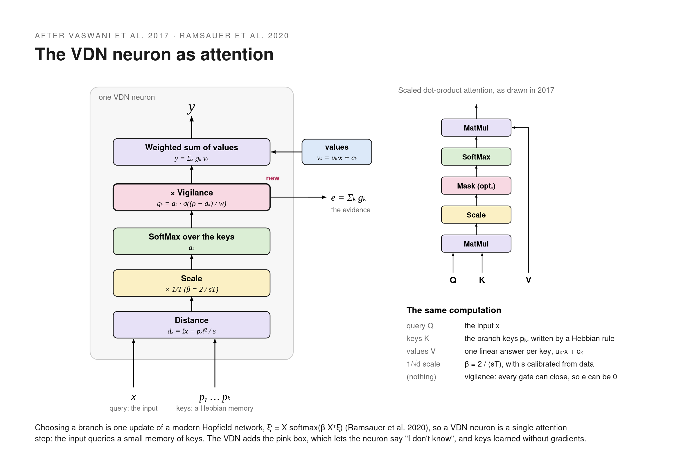
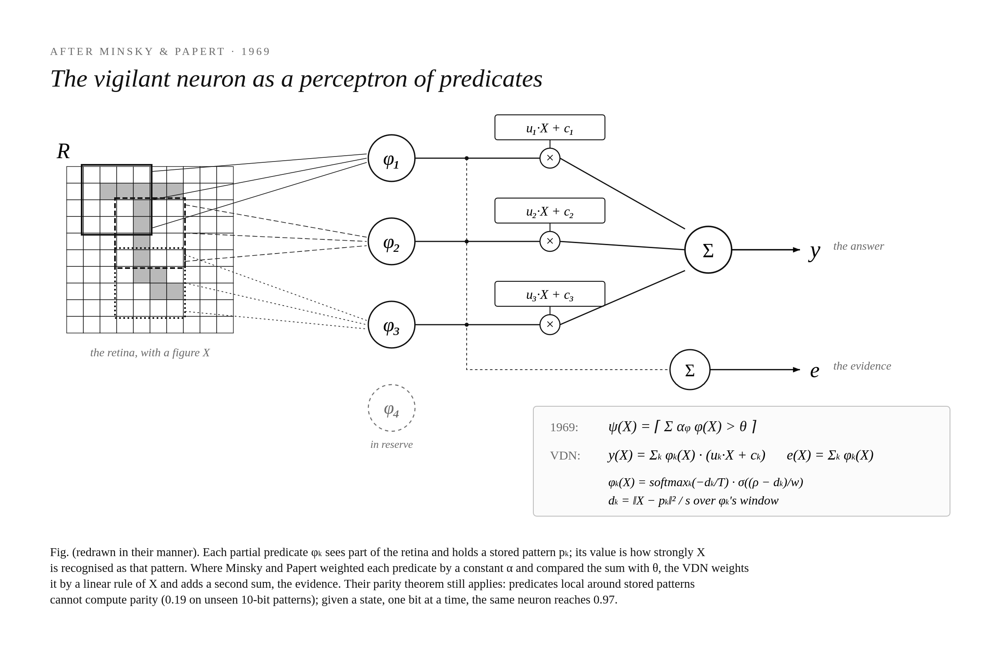
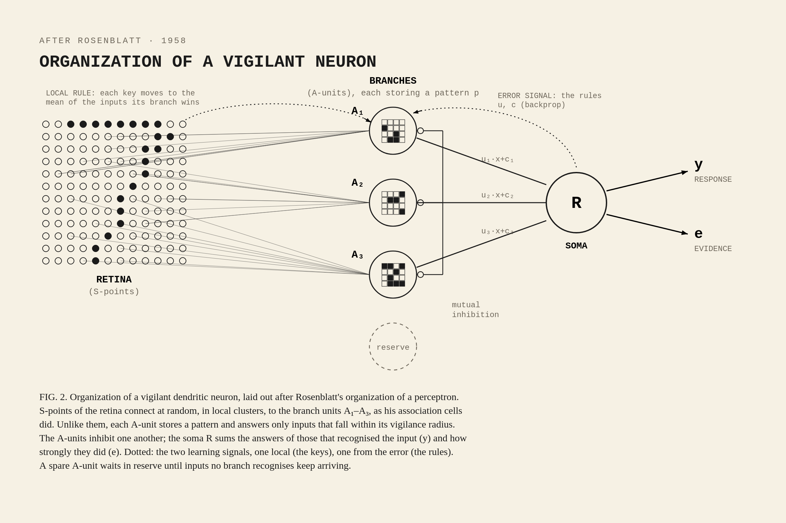
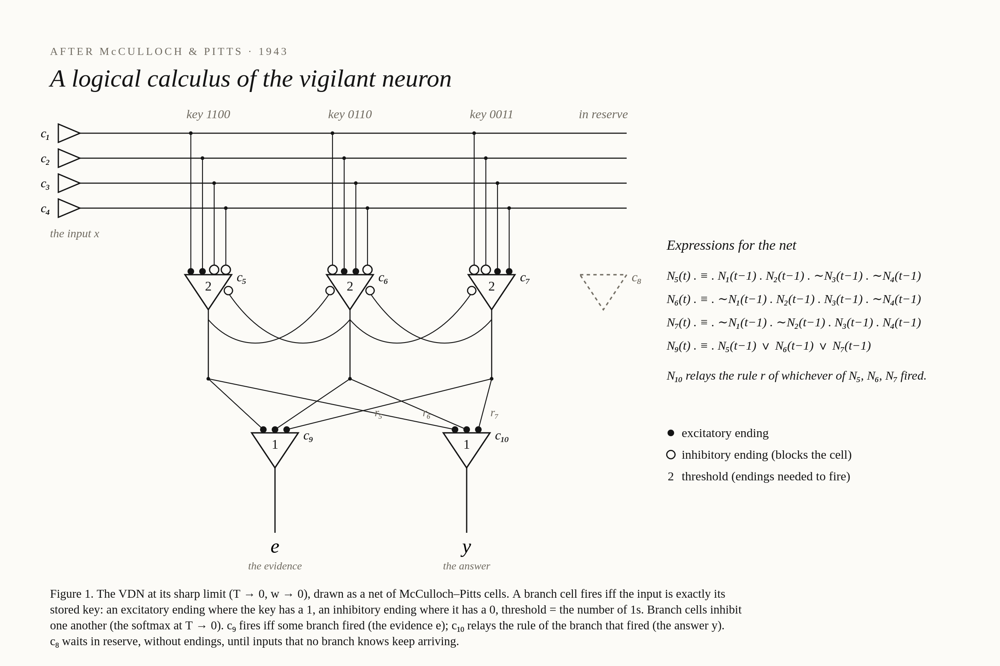
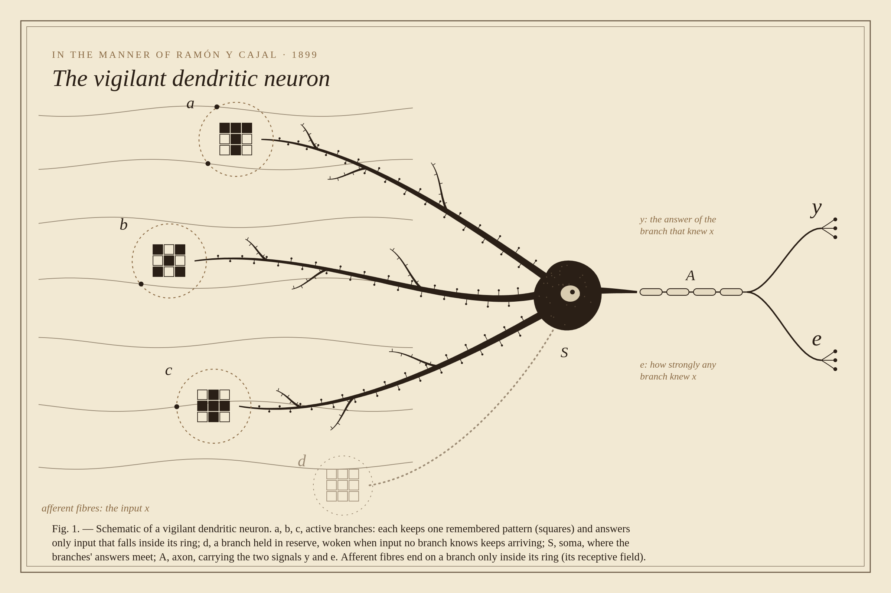

# Vigilant-Dendritic-Neuron

# as a textbook figure

# as attention

# 1969 · as Minsky & Papert's predicates

# 1958 · as Rosenblatt's perceptron

# 1943 · as a McCulloch–Pitts net

# 1899 · as a Cajal plate

